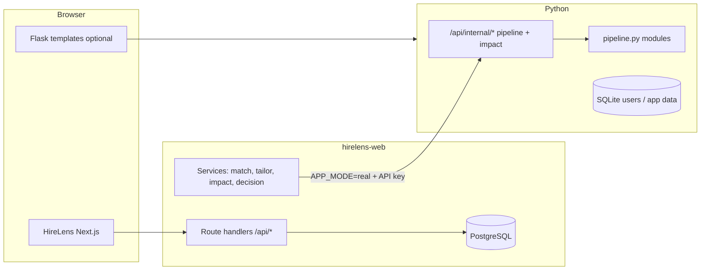

# HireLens / resume-job-matcher — application reference

Single document describing the **whole product**: what it is, how the pieces fit, how to run it, and where to look in code. For day-to-day commands and env details, see linked files at the end.

**Last updated:** 2026-04-03

---

## 1. What this application is

**HireLens** (branding) is a **resume ↔ job** decision and preparation tool:

- Paste or upload a **job description** and a **resume**.
- Get a **match score** and breakdown, optional **tailored resume** text, **ATS-style impact** metrics, and an **apply / maybe / skip** style **decision** with reasons.
- Track **application outcomes** (saved, applied, interviewed, etc.) against jobs.

The product does **not** automate applying on third-party sites (no LinkedIn bots). Users apply manually.

Business positioning and tiers are summarized in `BUSINESS_PLAN.md`.

---

## 2. Repository layout

| Area | Path | Role |
|------|------|------|
| **Python backend** | Repo root (`app.py`, `pipeline.py`, `matcher.py`, …) | Flask app: classic web UI, SQLite users, Stripe hooks, cron, **internal HTTP API** for the HireLens pipeline used by Next.js. |
| **HireLens web app** | `hirelens-web/` | **Next.js 15** (App Router), **Prisma**, **PostgreSQL**: primary modern UI (dashboard, jobs, tailor, analytics, resumes, diagnostics). |
| **Shared React (legacy/extra)** | `frontend/components/` | Reusable components; optional to merge into `hirelens-web`. |
| **Infra** | `Dockerfile`, `render.yaml` | Container / Render blueprint. See `DEPLOY.md`. |

Two “front doors” exist:

1. **Flask** — HTML templates, `/dashboard`, `/jobs`, auth, etc., on `PORT` (default **8765**).
2. **Next** — `http://127.0.0.1:3000` for HireLens UX; talks to Flask for **real** scoring/tailor/impact when configured.

---

## 3. Architecture (high level)



- **Mock mode (`APP_MODE=mock` or unset in older behavior):** Next can run **without** Flask; match/tailor/impact use **mocks** (fast, for UI dev).
- **Real mode (`APP_MODE=real`):** Next **requires** `FLASK_BASE_URL` and `HIRELENS_INTERNAL_API_KEY` (same value on Flask). Calls fail visibly if Flask is down or keys mismatch — no silent mock.

---

## 4. Flask application (Python)

### Stack

- **Flask**, **Gunicorn** in production (`DEPLOY.md`).
- **SQLite** (`app.db`) for sessions/users and app-specific data in the classic app.
- **Stripe** checkout + webhook routes.
- **Pipeline:** modules such as `pipeline.py`, `job_analysis.py`, `resume_parser.py`, `match_scoring.py`, `resume_tailoring.py`, `impact_eval.py` (names may vary slightly; see repo root).

### Default port

- `PORT` env, default **`8765`** (`app.py`). Older docs sometimes say `8080`; set `FLASK_BASE_URL` in Next to match whatever you run.

### Notable HTTP routes (non-exhaustive)

| Route | Purpose |
|-------|---------|
| `GET /health` | Health check |
| `GET /`, `/login`, `/signup`, `/logout`, `/dashboard`, `/pricing`, `/privacy`, `/terms`, `/refund` | Classic web UI |
| `POST /api/internal/v2/pipeline` | **Server-to-server** full pipeline (protected by `X-API-Key` / internal key) |
| `POST /api/internal/evaluate-impact` | Impact evaluation (same protection) |
| `POST /api/v2/pipeline`, `POST /api/evaluate-impact` | Variants / public API shapes (see `app.py` for exact contract) |
| `POST /api/create-checkout-session`, `POST /api/stripe/webhook` | Billing |
| `POST /api/cron/fetch-feed`, `POST /api/alerts/intake` | Jobs/alerts workflows |

**Internal API key:** set `HIRELENS_INTERNAL_API_KEY` in the environment for Flask; mirror the **same** string in `hirelens-web/.env.local`.

---

## 5. HireLens web (`hirelens-web/`)

### Stack

- **Next.js 15** (App Router), TypeScript.
- **Prisma** + **PostgreSQL** (`prisma/schema.prisma`).
- Services under `src/lib/services/` orchestrate **Flask vs mock** via `src/lib/flask/` and `src/lib/config/app-mode.ts`.

### Main pages (`src/app/`)

| Route | Purpose |
|-------|---------|
| `/` | Landing / entry |
| `/dashboard` | Overview |
| `/jobs` | Job list |
| `/jobs/[id]` | Job detail + resume panel (match, tailor, impact, decision) |
| `/resumes` | Resumes |
| `/tailor` | Tailor studio |
| `/analytics` | Analytics |
| `/diagnostics` | Runtime / DB / mode checks |

### API routes (`src/app/api/`)

| Area | Example path |
|------|----------------|
| Jobs | `POST /api/jobs/analyze` |
| Resumes | `POST /api/resume/upload`, data routes under `api/data/*` |
| Pipeline | `POST /api/match/score`, `POST /api/resume/tailor`, `POST /api/impact/evaluate`, `POST /api/decision/evaluate` |
| Outcomes | `api/outcomes/by-job`, `api/outcomes/update` |
| Misc | `api/dashboard/overview`, `api/diagnostics` |

### Data model (Prisma) — concepts

- **User** → owns **Resume**, **Job**, analyses.
- **Resume** (+ optional **ParsedResumeProfile** JSON).
- **Job** (+ **analyzedJson** from job analysis).
- **MatchAnalysis** — score, verdict, breakdown.
- **TailoredResume** — tailored text per job/resume pair.
- **ImpactMetric** — JSON metrics (e.g. ATS-style fields).
- **DecisionAnalysis** — recommendation, confidence, reasons, risks, links to match/impact.
- **ApplicationOutcome** — funnel status per user/job/resume (unique on `userId, jobId, resumeId`).
- **AgentRun** — optional logging of agent invocations.

---

## 6. User journey (happy path on Next)

1. Create or select a **job** (paste JD → analyze).
2. Create or select a **resume** (paste text).
3. Open **job detail** with that resume.
4. **Score match** → stores **MatchAnalysis**.
5. **Tailor resume** → creates **TailoredResume** (+ changelog metadata when available).
6. **Evaluate impact** → **ImpactMetric** on tailored version.
7. **Evaluate decision** → **DecisionAnalysis** (apply/maybe/skip style output).
8. Optionally record **application outcome** for tracking.

---

## 7. Environment variables (conceptual)

| Location | Examples |
|----------|----------|
| Flask `.env` | `SECRET_KEY`, `PORT`, `HIRELENS_INTERNAL_API_KEY`, Stripe keys, cron secrets |
| `hirelens-web/.env.local` | `DATABASE_URL`, `APP_MODE`, `FLASK_BASE_URL`, `HIRELENS_INTERNAL_API_KEY`, optional `HIRELENS_PIPELINE_DEBUG` |

Never commit real `.env` / `.env.local`. Use `.env.example` files as templates.

---

## 8. How to run locally (short)

**Postgres:** create DB (e.g. `hirelens`), set `DATABASE_URL` in `hirelens-web/.env.local`, then `npm run db:push` (or `npx prisma db push`).

**Flask:**

```bash
cd resume-job-matcher
export HIRELENS_INTERNAL_API_KEY="your-secret"
python3 app.py   # default http://127.0.0.1:8765
```

**Next:**

```bash
cd hirelens-web
npm install
npm run dev      # or npm run dev:clean if .next is broken
```

For **real** pipeline: `APP_MODE=real`, `FLASK_BASE_URL` matching Flask, **same** `HIRELENS_INTERNAL_API_KEY`.

---

## 9. Testing and quality

- Flask: `python -m unittest tests.test_smoke -v` (from repo root with venv).
- Next: `npm run build` for production build.

---

## 10. Deploy

See **`DEPLOY.md`**: Gunicorn example, Render blueprint, Docker.

---

## 11. Related documentation (this repo)

| File | Contents |
|------|----------|
| `PROJECT_HANDOFF.md` | Handoff snapshot, paths, optional next steps |
| `hirelens-web/docs/local-development.md` | Modes, DB, `dev:clean`, Playwright E2E, troubleshooting |
| `hirelens-web/docs/deploy.md` | HireLens Web (Next) deploy, env, ingest, validation |
| `hirelens-web/docs/REAL_PIPELINE_VALIDATION.md` | Checking real vs mock pipeline |
| `BUSINESS_PLAN.md` | Product/business v1 |
| `DEPLOY.md` | Production deploy |
| `CURSOR_DISCUSSION_ARCHIVE.md` | Exported Cursor chat (large; separate from this spec) |

---

## 12. Git remote

Pushes have used **`origin/main`** (e.g. GitHub `citraSul/HelloAI`). Confirm `git remote -v` before deploying.

---

*This file is meant to stay readable: update it when architecture or default ports change.*
